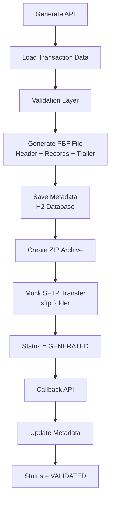

# PBF Generator

## Project Overview

PBF Generator is a Spring Boot application that simulates the ABT-to-NLP transaction settlement workflow. It generates PBF transaction files, validates settlement records, creates ZIP archives, stores processing metadata in an H2 database, performs a mock SFTP transfer, and handles callback-based status updates.

The implementation follows the PBF input file structure described in the ABT-TIBCO Integration Document and demonstrates an end-to-end backend file-processing workflow.

---

## Architecture Workflow

### Processing Flow

```text
Generate API
    ↓
Load Transaction Data
    ↓
Validate Records
    ↓
Generate PBF File
    ↓
Save Metadata
    ↓
Create ZIP Archive
    ↓
Move ZIP to Mock SFTP
    ↓
Status = GENERATED
    ↓
Process Callback
    ↓
Status = VALIDATED
```

### Workflow Diagram



---

## Features Implemented

* PBF file generation using Header, Record, and Trailer structure
* Dynamic file naming to prevent overwriting
* Four-digit file sequence generation
* Transaction validation layer
* ZIP archive generation
* Year/month-based file storage
* Metadata persistence using H2 database
* Unique RequestId generation
* Mock SFTP file transfer
* Callback processing
* Status tracking API
* Health check API
* SLF4J logging with Logback
* Global exception handling
* Unit tests for validation logic

---

## PBF File Structure

### Header

```text
H;PBF;YYYYMMDD;sequence;HH.mm.ss
```

Example:

```text
H;PBF;20260620;0001;20.06.56
```

### Record

```text
R;txnRef;reversedTxnRef;businessDate;crn;txnType;beId;beName;txnValue
```

Example:

```text
R;TXN001;;20260514;1009999505;NOL CARD JOURNEY;12345;NA;10.00
```

### Trailer

```text
T;00006
```

---

## API Endpoints

### Generate PBF

```http
GET /generate
```

Example:

```bash
curl http://localhost:8080/generate
```

---

### Check Status

```http
GET /status/{id}
```

Example:

```bash
curl http://localhost:8080/status/1
```

---

### Callback Processing

```http
POST /callback/{id}
```

Example:

```bash
curl -X POST http://localhost:8080/callback/1
```

---

### Health Check

```http
GET /health
```

Example:

```bash
curl http://localhost:8080/health
```

---

## Sample Status Response

### Before Callback

```json
{
  "id": 1,
  "filename": "pbf_20260620204157_0001.pbf",
  "filepath": "uploads/2026/june/pbf_20260620204157_0001.pbf",
  "noOfRecords": 6,
  "status": "GENERATED",
  "sftpSent": true,
  "requestId": "deb8b2ea-d67a-426c-adce-89ff23b24388",
  "responseStatus": "PENDING",
  "responseMessage": "Waiting for loyalty response"
}
```

### After Callback

```json
{
  "id": 1,
  "filename": "pbf_20260620204157_0001.pbf",
  "filepath": "uploads/2026/june/pbf_20260620204157_0001.pbf",
  "noOfRecords": 6,
  "status": "VALIDATED",
  "sftpSent": true,
  "requestId": "deb8b2ea-d67a-426c-adce-89ff23b24388",
  "responseStatus": "SUCCESS",
  "responseMessage": "Response received from loyalty system"
}
```

---

## Database Metadata

The `FILE_METADATA` table stores:

* ID
* Filename
* Filepath
* File Type
* Number Of Records
* RequestId
* Callback URL
* Status
* Response Status
* Response Message
* SFTP Sent Flag

Example final state:

```text
STATUS = VALIDATED
RESPONSE_STATUS = SUCCESS
SFTP_SENT = TRUE
```

---

## Logging

The application uses SLF4J with Spring Boot Logback.

Example log statements:

```java
logger.info("PBF generation started");
logger.debug("Loaded {} journey records for PBF generation", journeys.size());
logger.info("Metadata saved with id {} and requestId {}", metadata.getId(), metadata.getRequestId());
logger.info("ZIP moved to mock SFTP folder");
logger.error("PBF generation failed", exception);
```

### Log Levels

* INFO - Normal application flow
* DEBUG - Technical details such as record counts and file paths
* WARN - Validation warnings
* ERROR - Exceptions and failures

---

## Generated Output Locations

Generated PBF files:

```text
uploads/<year>/<month>/
```

Example:

```text
uploads/2026/june/pbf_20260620204157_0001.pbf
```

Mock SFTP ZIP files:

```text
sftp/
```

Example:

```text
sftp/pbf_20260620204157_0001.pbf.zip
```

---

## How To Run

Start the application:

```bash
./gradlew bootRun
```

Run tests:

```bash
./gradlew test
```

Open the H2 Console:

```text
http://localhost:8080/h2-console
```

Database Details:

```text
JDBC URL : jdbc:h2:mem:testdb
Username : sa
Password :
```

---

## Technologies Used

* Java 25
* Spring Boot 3
* Spring Web
* Spring Data JPA
* H2 Database
* Gradle
* SLF4J / Logback
* JUnit 5

---

## Future Enhancements

* Replace hardcoded sample data with CSV/API/database input
* Add PostgreSQL support for persistent metadata storage
* Integrate with a real SFTP server
* Add Swagger/OpenAPI documentation
* Add Docker deployment support
* Add file download API
* Add checksum and reconciliation support
* Add LPBF/response file processing
* Add scheduler-based automatic settlement file generation

---

